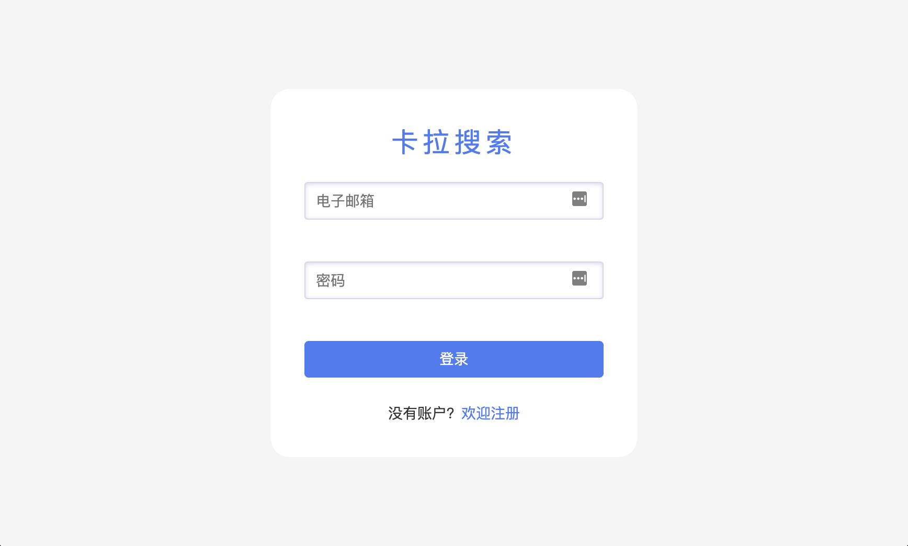
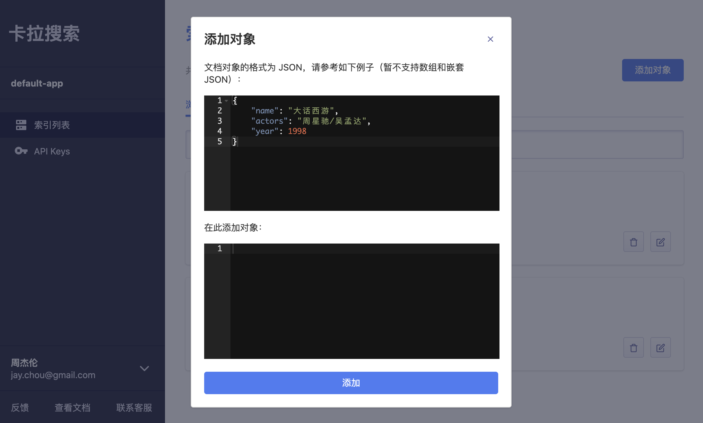
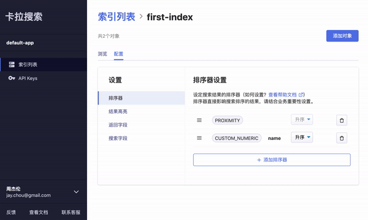
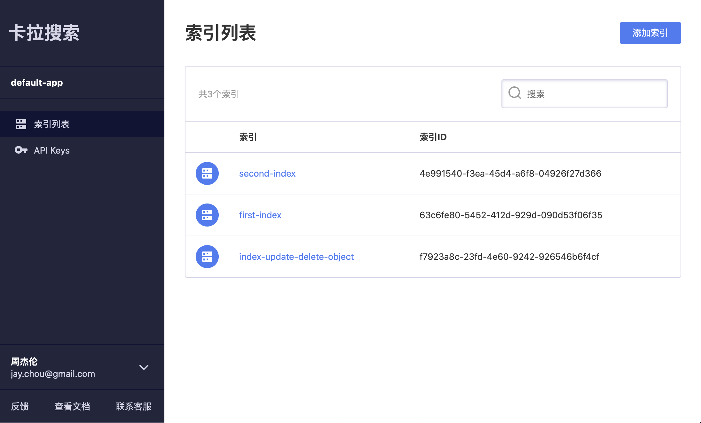
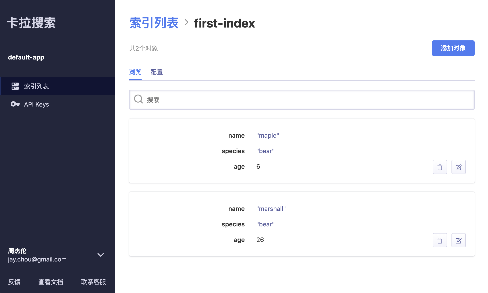
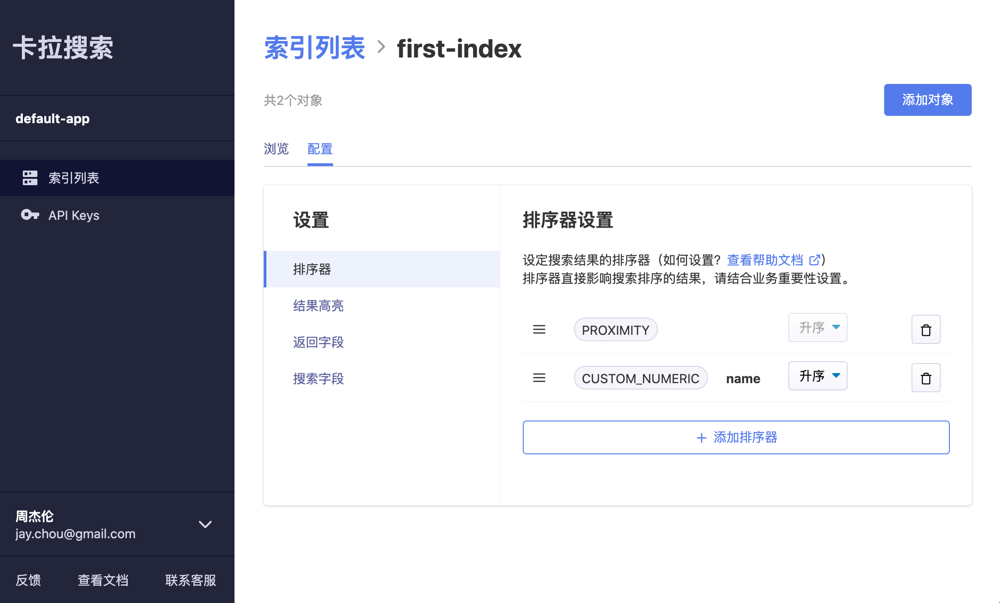
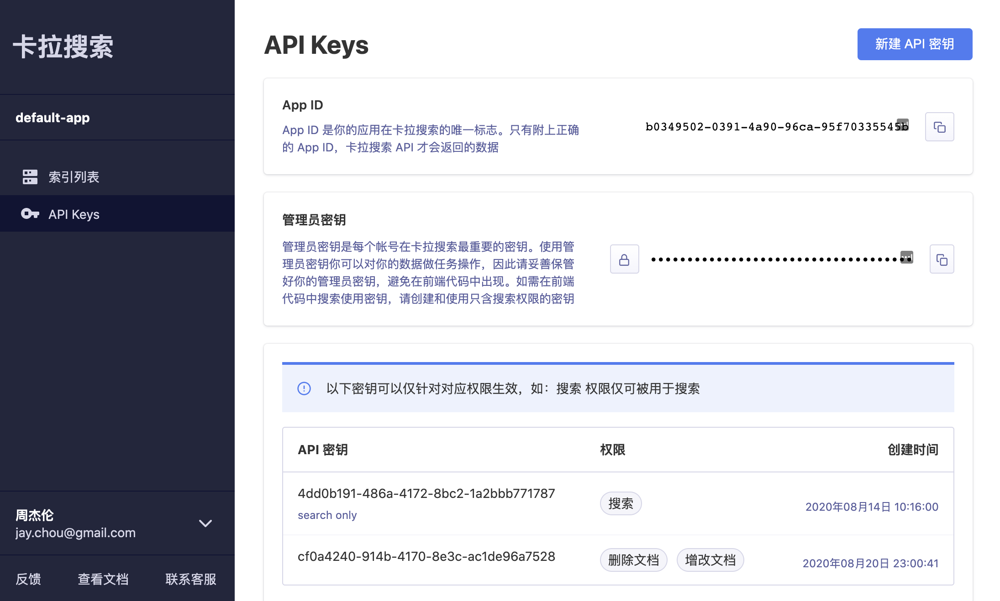

## Overview



[Kala Search Dashboard](https://dashboard.kalasearch.cn/) is a management tool for users of **[Kala Search](https://kalasearch.cn/)** to configure and customize their search requirement. All the essential configurations (including **ranking, word highlighting, whitelist and blacklist fields**, etc.) are consolidated and visualized on this platform, allowing users to easily navigate and setup based on their preference.

> **[Kala Search](https://kalasearch.cn/)** offers **powerful, fast, easy to use and deploy** in-app search engine. Without spending extra time in developing their own search engine, users can simply set up their search feature within minutes with the help of Kala Search API and SDK.

## Stack
The app is written with [React](https://reactjs.org/) + [Redux](https://redux.js.org/) and I used [Styled Components](https://styled-components.com/) for the UI framework. Redux Promise Middleware was used to handle async action creators in Redux. For the non-user level operations, I used [Kala Search JavaScript SDK](../kala-search-javascript-sdk) to make API requests with the presence of valid application ID and API Key obtained when user successfully signed in.

 ## Main Features
- User authentication and verification with JWT
- New index creation; new API Key creation; Add, edit, and delete documentation object from a cetain index via [Kala Search REST API]("https://kalasearch.cn/docs/rest-api-index-and-search")
- Able to configure ranking, word highlighting, whitelist and blacklist fields, etc. based on user's requirement
- Visualize and browse setting changes in effect immediately on index detail page
- Clean layouts and designs for effective navigation

### Protected Routing
I used [**Higher Order Components (HOC)**](https://reactjs.org/docs/higher-order-components.html) to set up protected authentication routings. Pages requires user to sign in to view are wrapped inside the `PrivateRoute` component whereas login and register page, for example, are wrapped in `PublicRoute`.

An example code snippet:
```jsx
import React from 'react';
import { Route, Redirect } from 'react-router-dom';
import { isLogin } from '../helpers'

const PrivateRoute = ({ component: Component, ...rest }) => (
  <Route {...rest} render={props => {
    return (
      isLogin() ? 
      <Component {...props} {...rest}/> : 
      <Redirect to={{ pathname: '/login', state: { from: props.location } }} />
    )
  }}/>
)

export default PrivateRoute;
```

### JSON Editor
One of the main features is to allow user to add and edit a JSON object. I used [`react-ace`](https://github.com/securingsincity/react-ace) to build the JSON editor with validation and auto formatting features.


### Drag and Drop Interface
Another feature is to enable drag and drop interfaces while user changing the order of different types of rankers in config setting page. With the help of [`react-dnd`](https://react-dnd.github.io/react-dnd/about), I was able to incorperate this easy to use feature to the dashboard.



### Everything's organized
It is highly benenficial to keep the code clean and organzied though the dashboard is still being developing and optimized with more features to come. I strive to make every project professional and managable regardless its scale or type. 

## More Screenshots







