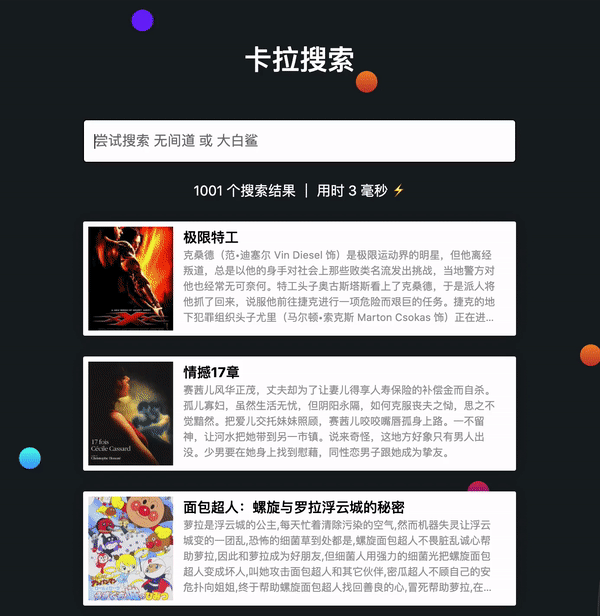

## Overview

This is a simple demo website for [Kala Search](https://kalasearch.cn/) to demonstrate their high-speed frontend search experience. You can check the demo live [here](https://mystifying-beaver-391564.netlify.app/).

> *Kala Search* is a SaaS that offers **in-app search engine**. Without spending extra time in developing their own search engine, clients can simply set up their search feature within minutes with the help of Kala Search API and SDK.

## Main Features
- Search as you type
- Render results with highlighted query word(s)

## Stack
This search demo app uses [Kala Search's JavaScript SDK](https://github.com/Kalasearch/kalasearch-javascript-sdk) to make search requests through Kala Search's REST API. It is built with React and [Rebass](https://rebassjs.org/) for the UI framework. 

>Rebass is a library of highly-composable, primitive UI components for React, built with styled-components to keep styles isolated and reduce the need to write custom CSS in your application.

This was also an oppotunity for me to learn and use Rebass. Movie data were pulled from [Douban movie](https://www.douban.com/).

## Source Code
[Check it out on Github](https://github.com/chrystal-lyu/douban_kalasearch)
