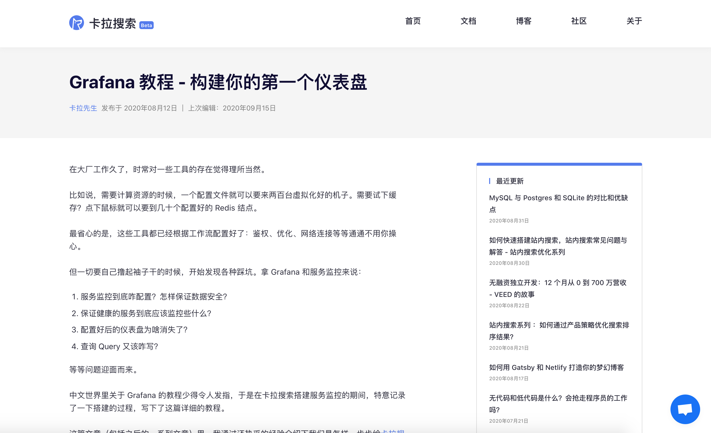
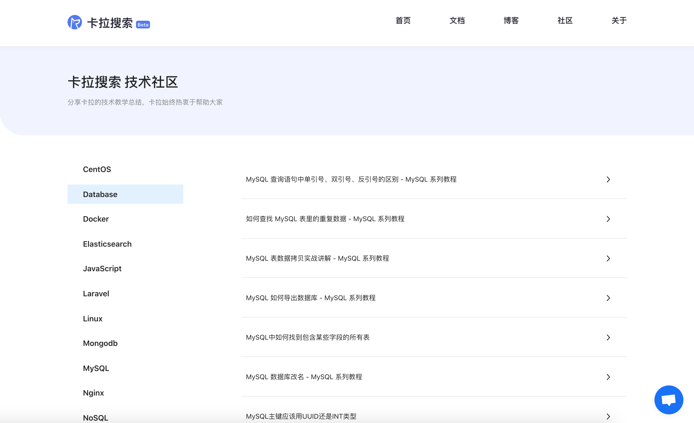
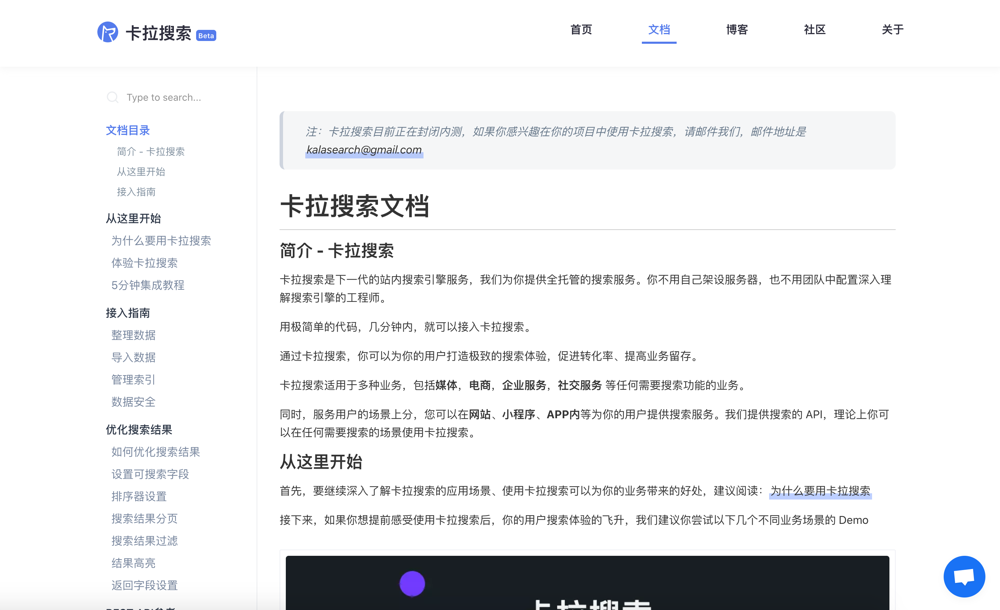
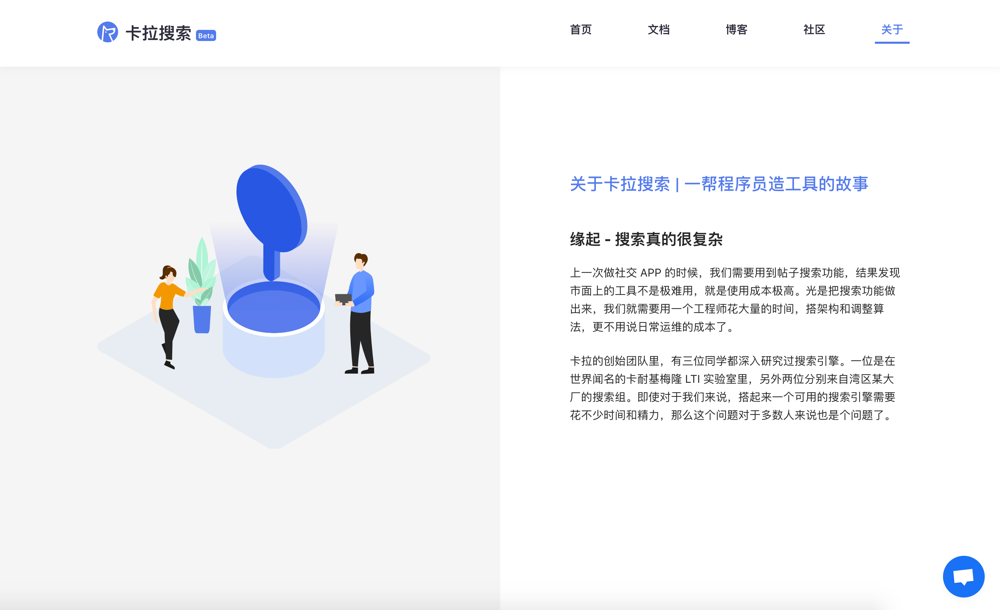

## Overview

This official website is built for [Kala Search](https://kalasearch.cn/) to showcase their service. Kala Search offers powerful, fast, easy to use and deploy **in-app search engine**. Without spending extra time in developing their own search engine, users can simply set up their search feature within minutes with the help of Kala Search API and SDK.

## Main Features
- Compose documentaion post in [mdx](https://mdxjs.com/)
- Write and organize documentaion with [Docz](https://www.docz.site/)
- Display [community tutorials](https://kalasearch.cn/community) according to tag names

## Stack
The website is built with [Gatsby](https://www.gatsbyjs.org/) from its raw default template starter. [Styled component](https://styled-components.com/) is used for the UI framework. 

Since Gatsby has the process of routes and pages creation taken care of, it was relatively easy to build the basic structure of the website. However, the blog post page and the community tutorials with tags page required further work to develop. After reading [Gatsby's official](https://www.gatsbyjs.com/tutorial/part-seven/) documentation and couple of useful tutorials in the community, I was able to understand the logic behind it and successfully do the job.

Keeping track of the documentation for a SaaS software is essential. I incorperated [Docz](https://www.docz.site/) into the website to help writing beautiful documentation in [mdx](https://mdxjs.com/). 

## More Screenshots

