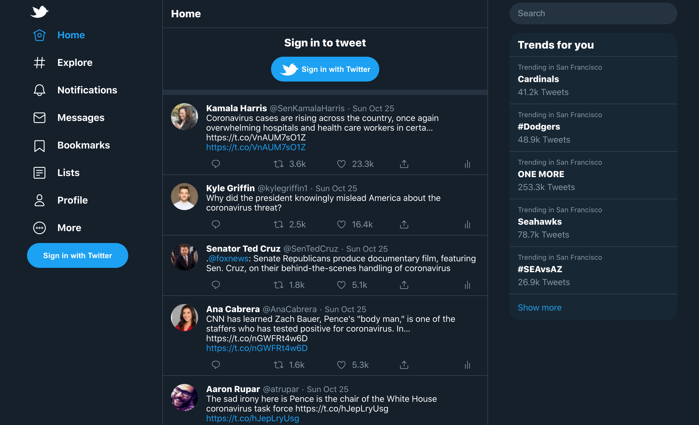
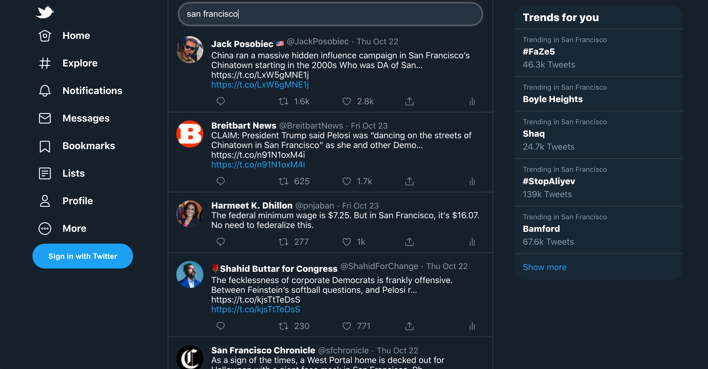
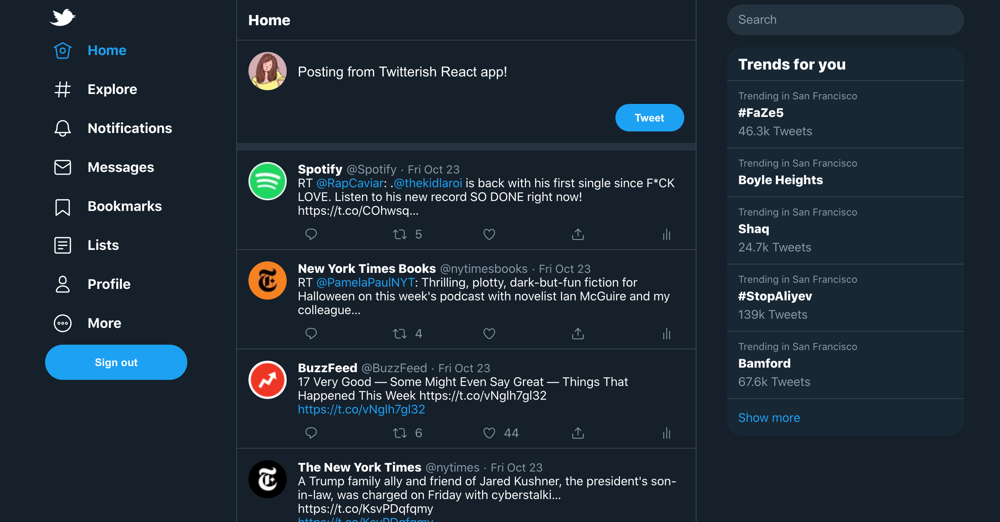
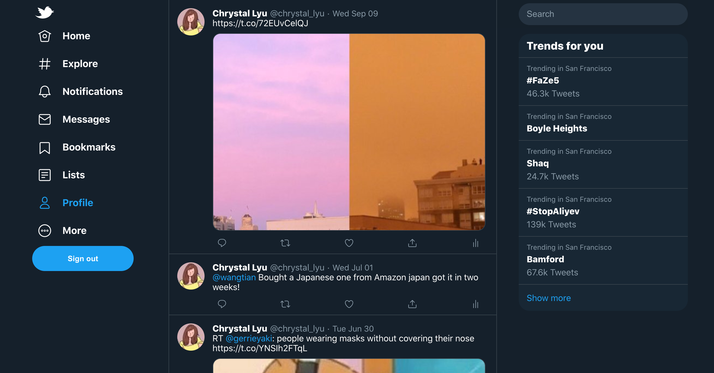

## Overview

[Twitterish React](https://twitterish-react.herokuapp.com/) is a twitter mockup website I developed as a practice for a React + Redux web app with third party authentication feature. [Twitter public API](https://developer.twitter.com/en/docs/twitter-api) was used for data presented in the project. Users are able to post new tweet from it once they are logged in with their actual Twitter account!

## Main Features
- Display public trending tweets
- Search tweet by query
- Click trending topics to show its popular tweets
- Sign in with your own Twitter account
- Access your own timeline and past tweets of your own once signed in
- Post new tweet once signed in

## Stack
The website is built with React + Redux for the front-end and Node.js + Express for the backend. I am using styled component for the UI framework. Firebase is used to suppport Twitter authentication. All the tweets data are powered by [Twitter public API](https://developer.twitter.com/en/docs/twitter-api).

## More Screenshots

## Source Code
[Check it out on Github](https://github.com/chrystal-lyu/twitter-clone)
